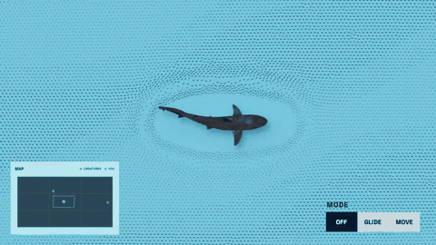
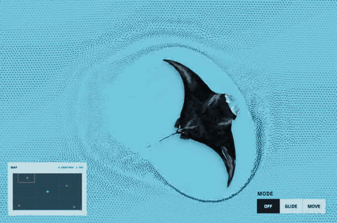
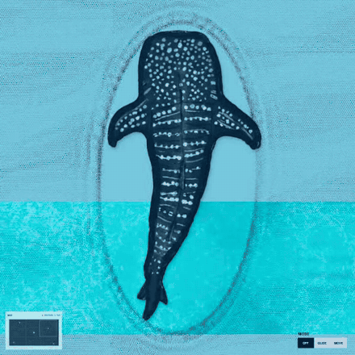
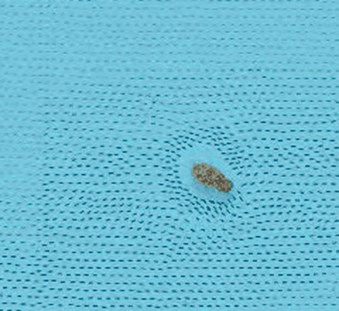
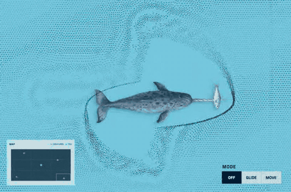

# Missing Piece

*A quiet, illustrated ocean you can drift through as a reef shark.*

[Explore the live world](https://sid-subspace.github.io/the-missing-piece/).

Missing Piece is a small browser ocean built around one reef shark. Guide it through a slow-moving school; four illustrated animals drift elsewhere in the 4 × 4 world. It is meant to feel open and unhurried. There is no score or finish line—move through the water, watch the school make room, and notice what appears.

## How to explore

Move your pointer to guide the reef shark.

- **MAP** marks encounter animals in red, the shark in blue, and the current view with a white outline.
- **MODE** changes how the shark moves:
  - **OFF** holds it still.
  - **GLIDE** follows your pointer while the camera stays in place.
  - **MOVE** follows your pointer and pans the camera through the world. This is the starting mode.

## Four encounters

| Manta ray | Whale shark |
| --- | --- |
|  |  |
| Giant manta rays are the largest rays, with wingspans over 20 feet. [Smithsonian Ocean](https://ocean.si.edu/ocean-life/sharks-rays/filtering-giants) | Whale sharks are the largest known fish and can reach nearly 50 feet long. [Smithsonian Ocean](https://ocean.si.edu/ocean-life/sharks-rays/filtering-giants) |
| Broadclub cuttlefish | Narwhal |
|  |  |
| While hunting, broadclub cuttlefish can send dark stripes down their heads and arms to disguise their approach. [Peer-reviewed study](https://pmc.ncbi.nlm.nih.gov/articles/PMC11939058/) | A male narwhal’s tusk is an elongated tooth that grows from the upper left jaw and spirals counterclockwise. [NOAA Ocean Exploration](https://oceanexplorer.noaa.gov/ocean-fact/narwhal/) |

## How it is built

HTML provides the scene, CSS layers the water and controls, and JavaScript animates the fish school, animal drift, map, and camera. The animal cutouts use transparent video: HEVC with alpha when supported, with WebM as the fallback. The site is hosted on GitHub Pages.

**Credit:** Project by Peter. Species notes link to their sources above.
